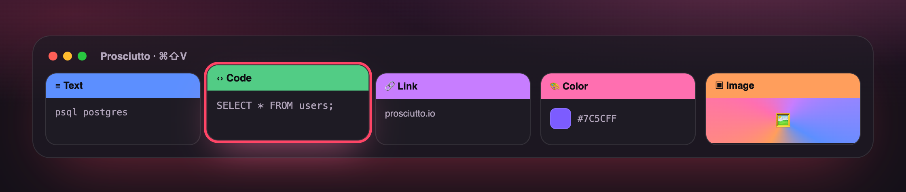
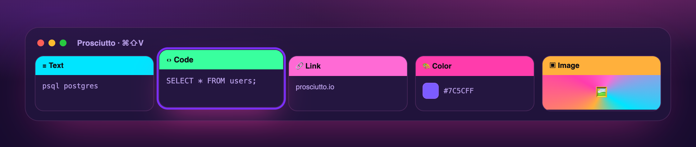
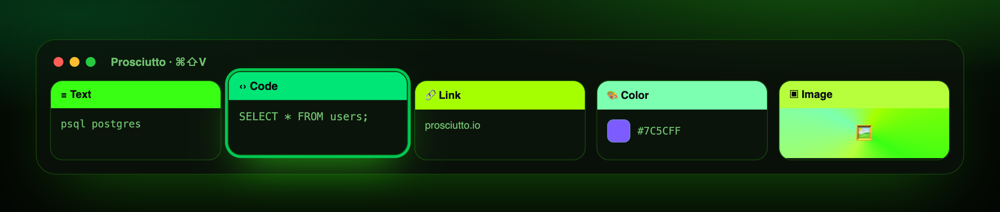
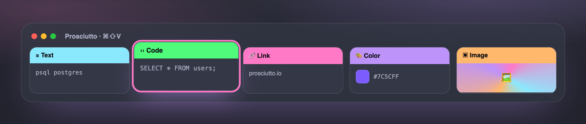
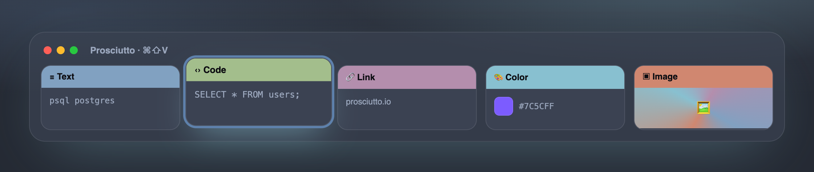
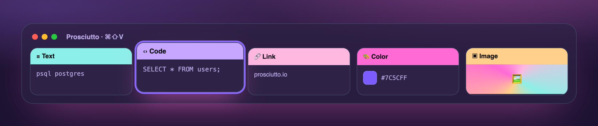
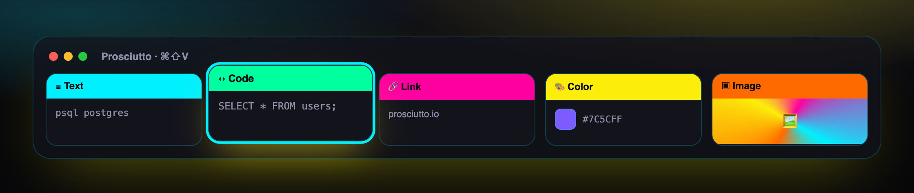
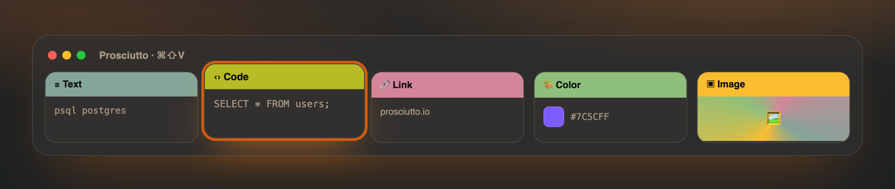
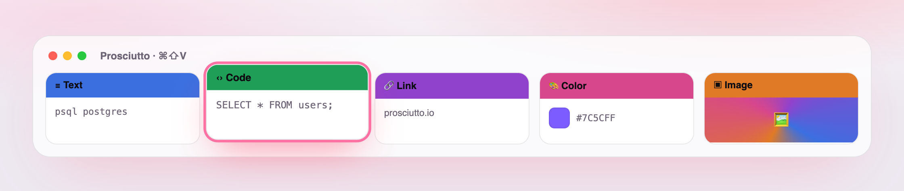

<div align="center">


# Prosciutto

**The clipboard manager for macOS that's actually delicious.** 🍖

Your clipboard history as a fast, beautiful, colour-coded gallery — in 9 gloriously unhinged themes.
Free. Open source. Zero dollars, no sign-up, no nonsense.

[🌐 prosciutto.io](https://prosciutto.io) · [⬇ Install](#install) · [🎨 Themes](#themes)

[](https://www.apple.com/macos/)
[](https://swift.org)
[](LICENSE)
[](#contributing)

<br>



<sub>The gallery, mid-summon. It comes in nine themes — [try them live at prosciutto.io](https://prosciutto.io).</sub>

</div>

---

## Hey 👋

You copy things all day — a link, a snippet, that one command you always forget. macOS remembers
exactly one of them. Prosciutto remembers **all** of them.

Tap a hotkey and your history slides up as a row of big, colourful cards — text, links, code,
images, colours, files, map locations, each with its own look. Arrow to the one you want, hit
return, it's pasted back into whatever you were doing. Fast, pretty, out of your way.

**Free**, **open source**, lives entirely **on your Mac**, one Homebrew command. No account, no
subscription, no catch.

> "I've signed treaties with less ceremony than pasting used to require. Now it's ⌘⇧V and done."
> — a definitely-real world leader, over on [prosciutto.io](https://prosciutto.io) 😉

## What it does

- 🎴 **Visual card gallery** — big cards with a coloured type header, source-app icon, and rich previews (images, links, colour swatches, code, files)
- 🌈 **Type colour-coding** — text, link, image, colour, code, file each have their own colour; sections show as a separate tag so colour never means two things
- ⌨️ **Keyboard-first** — `⌘⇧V` to summon, arrows to move, `⏎` to paste, `⌘1`–`⌘9` to quick-paste, `⌘⌫` to delete, `esc` to dismiss
- 📌 **Pin, reorder & organise** — pin favourites and drag to reorder them (stable `⌘1`–`⌘9`); file clips into custom **sections** (drag a card onto a section; recolour, rename, drop-to-file)
- 🏷️ **Name any clip** — click a card's title to rename it in place; titles are searchable (name a password "Instagram", find it by "instagram")
- ✏️ **Inline edit** — edit content right in the card, no modal; code clips get a monospaced editor with one-click **JSON formatting**
- 📸 **Auto-copy screenshots** *(optional)* — turn it on and every new screenshot lands on the clipboard, ready to paste as the file
- 🖼️ **Edit images in Preview** — open an image clip in Preview from the gallery; when you save, the edit comes back as a fresh clip
- 🔎 **Search & filter** — live search across titles and content, filter by type
- 🎨 **9 full named themes** — not accent swatches; each is a whole world (background + card surfaces + per-type colours + accent). Pick a personality, or roll your own with a **Custom** accent (see [Themes](#themes) below)
- 🔁 **Two paste modes** — paste automatically on select, or "load" the item so your next `⌘V` pastes it
- 🔔 **Optional copy sound**
- 🔒 **Privacy-first** — honours `org.nspasteboard.Concealed`/`Transient` markers and a password-manager blocklist; everything is stored locally, no telemetry

## Themes

Nine self-contained themes — each restyles the background, card surfaces, per-type colours **and**
accent, so switching feels like a whole new app. Pick your vibe in **Settings → Theme**:

| | | |
|:--:|:--:|:--:|
|  |  |  |
| 🍖 **Prosciutto** — house ham-pink | 🌆 **Synthwave** — 80s neon sunset | 🟩 **Matrix** — phosphor terminal |
|  |  |  |
| 🧛 **Dracula** — dev-famous purple | 🧊 **Nord** — arctic & calm | 🌸 **Vaporwave** — pastel dream |
|  |  |  |
| ⚡ **Cyberpunk** — neon high-contrast | 🟫 **Gruvbox** — warm retro | ☀️ **Daylight** — clean & bright |

…plus **Custom**, which themes a neutral base with any accent colour you like. All static — no
animated backgrounds — so scrolling stays buttery. [See them switch live →](https://prosciutto.io)

### Roadmap

OCR search inside images, a local MCP server for AI tools, and iCloud sync across Mac / iPhone / iPad.
The storage layer is already iCloud-ready.

## Install

```sh
brew install --cask amirchuosho/prosciutto/prosciutto
```

That's it. Prosciutto isn't Apple-notarized yet (that needs a paid Apple
Developer account), so the tap's cask clears the macOS Gatekeeper quarantine for
you automatically — no "could not verify" prompt, no manual steps.

Then grant **Accessibility** (below) so it can paste into other apps.

### Permissions

Prosciutto asks for **Accessibility** access so it can paste into the app you're using. Without it,
items are copied to the clipboard and you press `⌘V` yourself. Grant via
**System Settings → Privacy & Security → Accessibility**.

## Privacy

All clipboard data lives in a local Core Data store on your Mac. Nothing is sent anywhere. The only
network requests are favicon fetches for link cards.

## Build from source

Requires **Xcode 15+** and [XcodeGen](https://github.com/yonaskolb/XcodeGen).

```sh
brew install xcodegen
git clone https://github.com/amirchuosho/prosciutto.git
cd prosciutto

swift test            # run the ProsciuttoKit logic suite
xcodegen generate     # generate Prosciutto.xcodeproj from Project.yml
open Prosciutto.xcodeproj
```

## Architecture

Logic lives in a pure Swift package, **`ProsciuttoKit`** (capture, dedupe, kind detection, exclusion,
retention, search, store protocol), fully unit-tested with `swift test` and free of any UI
dependency. The **app target** (SwiftUI + AppKit) provides the Core Data store, menu bar, slide-up
panel, global hotkey, and paste synthesis.

The Xcode project is generated from `Project.yml` via XcodeGen, so the `.xcodeproj` is never edited
by hand (and stays out of version control).

```
Sources/ProsciuttoKit/   # logic library (testable, no UI)
App/Prosciutto/          # SwiftUI + AppKit app
Project.yml              # XcodeGen project definition
```

## Contributing

Issues and PRs welcome. Please run `swift test` before submitting; the logic layer is TDD-first, so
add tests for new behaviour in `ProsciuttoKit`. Keep UI changes focused and match the existing
patterns.

## License

[MIT](LICENSE) — © 2026 Prosciutto contributors.
