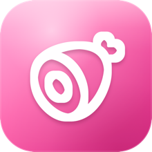

<div align="center">



# Prosciutto

**A visual, open-source clipboard manager for macOS.**

Your clipboard history as a fast, beautiful, colour-coded gallery.

[](https://www.apple.com/macos/)
[](https://swift.org)
[](LICENSE)
[](#contributing)

</div>

---

Prosciutto keeps a rich, visual history of everything you copy. Hit a global hotkey and a
horizontal gallery of cards slides up from the bottom of your screen, colour-coded by type.
Scroll, search, pin, and paste, without ever leaving the app you're in.

## Features

- 🎴 **Visual card gallery** — big cards with a coloured type header, source-app icon, and rich previews (images, links, colour swatches, code, files)
- 🌈 **Type colour-coding** — text, link, image, colour, code, file each have their own colour; sections show as a separate tag so colour never means two things
- ⌨️ **Keyboard-first** — `⌘⇧V` to summon, arrows to move, `⏎` to paste, `⌘1`–`⌘9` to quick-paste, `⌘⌫` to delete, `esc` to dismiss
- 📌 **Pin, reorder & organise** — pin favourites and drag to reorder them (stable `⌘1`–`⌘9`); file clips into custom **sections** (drag a card onto a section; recolour, rename, drop-to-file)
- 🏷️ **Name any clip** — click a card's title to rename it in place; titles are searchable (name a password "Instagram", find it by "instagram")
- ✏️ **Inline edit** — edit content right in the card, no modal; code clips get a monospaced editor with one-click **JSON formatting**
- 🔎 **Search & filter** — live search across titles and content, filter by type
- 🎨 **Themes** — System / Dark / Light (Light is a warm cream), accent themes (Prosciutto, Midnight, Forest, Mono) + custom colour, with a bold gradient selection
- 🔁 **Two paste modes** — paste automatically on select, or "load" the item so your next `⌘V` pastes it
- 🔔 **Optional copy sound**
- 🔒 **Privacy-first** — honours `org.nspasteboard.Concealed`/`Transient` markers and a password-manager blocklist; everything is stored locally, no telemetry

### Roadmap

OCR search inside images, a local MCP server for AI tools, and iCloud sync across Mac / iPhone / iPad.
The storage layer is already iCloud-ready.

## Install

**Download the DMG** from the [latest release](https://github.com/amirchuosho/prosciutto/releases/latest),
open it, and drag **Prosciutto** into **Applications**.

Prosciutto is open source and **not yet notarized by Apple** (that needs a paid
Apple Developer account). So on first launch macOS Gatekeeper blocks it. Clear the
quarantine flag once — either:

```sh
xattr -dr com.apple.quarantine /Applications/Prosciutto.app
```

…or open it once via **System Settings → Privacy & Security → “Open Anyway”**.
After that it launches normally.

> Homebrew cask coming once notarized:
> ```sh
> brew install --cask prosciutto   # coming soon
> ```

### Permissions

Prosciutto asks for **Accessibility** access so it can paste into the app you're using. Without it,
items are copied to the clipboard and you press `⌘V` yourself. Grant via
**System Settings → Privacy & Security → Accessibility**.

## Privacy

All clipboard data lives in a local Core Data store on your Mac. Nothing is sent anywhere. The only
network requests are favicon fetches for link cards.

## Build from source

Requires **Xcode 15+** and [XcodeGen](https://github.com/yonaskolb/XcodeGen).

```sh
brew install xcodegen
git clone https://github.com/amirchuosho/prosciutto.git
cd prosciutto

swift test            # run the ProsciuttoKit logic suite
xcodegen generate     # generate Prosciutto.xcodeproj from Project.yml
open Prosciutto.xcodeproj
```

## Architecture

Logic lives in a pure Swift package, **`ProsciuttoKit`** (capture, dedupe, kind detection, exclusion,
retention, search, store protocol), fully unit-tested with `swift test` and free of any UI
dependency. The **app target** (SwiftUI + AppKit) provides the Core Data store, menu bar, slide-up
panel, global hotkey, and paste synthesis.

The Xcode project is generated from `Project.yml` via XcodeGen, so the `.xcodeproj` is never edited
by hand (and stays out of version control).

```
Sources/ProsciuttoKit/   # logic library (testable, no UI)
App/Prosciutto/          # SwiftUI + AppKit app
Project.yml              # XcodeGen project definition
```

## Contributing

Issues and PRs welcome. Please run `swift test` before submitting; the logic layer is TDD-first, so
add tests for new behaviour in `ProsciuttoKit`. Keep UI changes focused and match the existing
patterns.

## License

[MIT](LICENSE) — © 2026 Prosciutto contributors.
